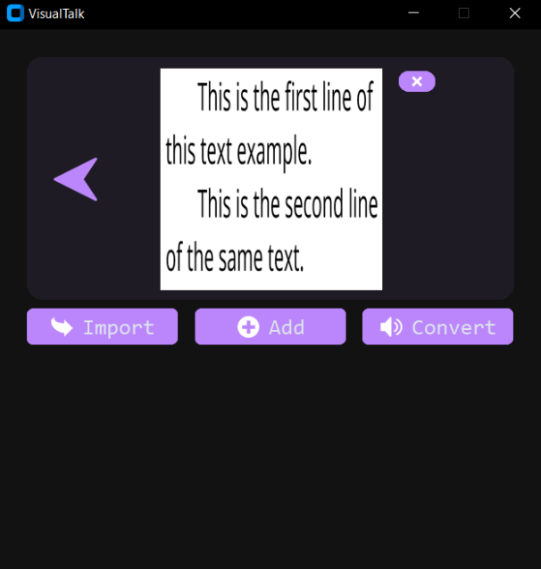
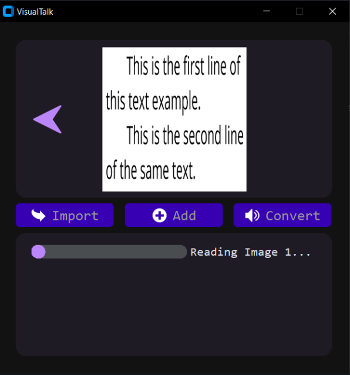
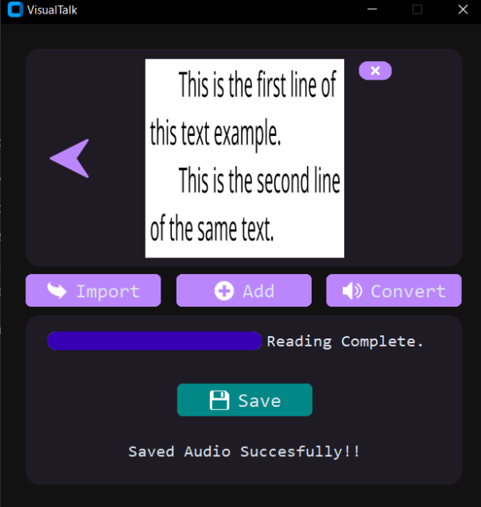

# VisualTalk

This is a Python script that converts text from images to speech using the EasyOCR and pyttsx3 libraries. It provides a simple graphical user interface (GUI) for importing images, processing them, and saving the generated speech as an audio file.

## Features

- Import multiple image files (PNG, JPG, JPEG).
- Convert text from images to speech.
- Save the generated speech as an audio file (MP3 format).
- User-friendly graphical interface.

## Requirements

To run this script, you need to have the following libraries installed:

- `customtkinter`: A custom tkinter library for GUI elements.
- `PIL`: The Python Imaging Library for working with images.
- `pyttsx3`: A text-to-speech conversion library.
- `easyocr`: A library for optical character recognition (OCR).

You can install these libraries using the `requirements.txt` file.

## Installation

1. Clone this repository:

   ```bash
   git clone https://github.com/AbhinandanCodes/VisualTalk.git
   cd your-repo
   ```

2. Install the required libraries using pip:
    ```bash
    pip install -r requirements.txt
    ```

## Usage
1. Run the script:
    ```bash
    python main.py
    ```
2. Use the GUI to import images, convert them to text, and save the generated speech as an audio file.

## Screenshots

|   |   |
|---|---|
|   |   |

## Contributing

Contributions are welcome! If you would like to contribute to EXPENZA, please follow these steps:

1. Fork the repository.
2. Create a new branch: `git checkout -b my-feature`.
3. Make your changes and commit them: `git commit -am 'Add some feature'`.
4. Push to the branch: `git push origin my-feature`.
5. Submit a pull request.

Please ensure your code adheres to the project's coding conventions and includes appropriate tests.

## License

This project is licensed under the [MIT License](https://opensource.org/licenses/MIT).

---

Thank you for your interest in VisualTalk! I appreciate your interest and hope this tool is helpful to you. If you have any questions or feedback, please don't hesitate to reach out.
